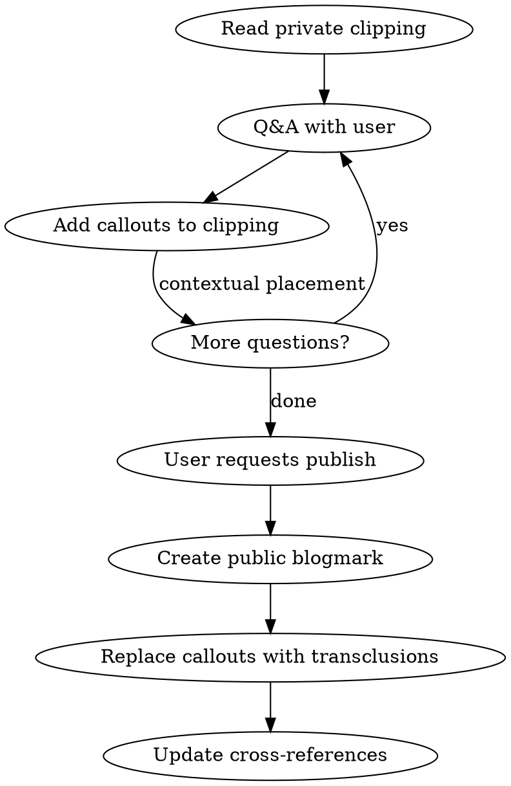

# Studying Articles

## Overview

Interactive study flow: read a private clipping, discuss it via Q&A, annotate the clipping with callouts, then publish discussions as a public blogmark with transclusions back to the private note.

## Workflow



## Phase 1: Q&A and Annotation

### Tone
- User speaks informally — preserve their voice in callouts
- Synthesize the discussion, don't paste raw conversation
- Go beyond the source material: add context, history, connections

### Callout Types

| Type | Use for |
|------|---------|
| `[!question]` | Q&A about concepts |
| `[!example]` | Concrete examples, worked problems |
| `[!info]` | Supplementary context, cross-references |
| `[!warning]` | Misconceptions, gotchas, open problems |

### Callout Rules
- Place **contextually after the relevant content**, not grouped at end
- One concept per callout, self-contained
- Use `==highlights==` for key takeaways
- No tables inside callouts (breaks Obsidian rendering) — use bullet lists

## Phase 2: Publish as Blogmark

When user says to publish/extract:

1. **Create public blogmark** at `content/blogmarks/<same filename as private clipping>.md`
   - Frontmatter: `tags: [Blogmarks]`
   - AI disclosure callout (see below)
   - Brief summary sentence of the source article
   - All discussion callouts from the private clipping
   - Each callout gets a block ID on last line: `> ^block-id`

2. **Replace callouts in private clipping** with section transclusions:
   - `![[blogmarks/<filename>#^block-id]]` (folder path required for disambiguation)
   - Place each transclusion at the exact location where the callout was

3. **Cross-references** in the public blogmark:
   - Public-to-public: wikilinks `[[Other Note]]`
   - Public-to-private: external URLs, never wikilinks

### AI Disclosure
Every public blogmark starts with:
```markdown
> [!info] AI-assisted annotations
> <brief description of what was helped> with Claude <model> via Claude Code.
```

### Block ID Syntax
Block IDs MUST be inside the blockquote on the last line:
```markdown
> [!question] Title
> Content here
> ^my-block-id
```

NOT on a separate line after the callout (creates a standalone block, breaks transclusion).

## Common Mistakes

| Mistake | Fix |
|---------|-----|
| Block ID on own line after callout | Put `> ^id` on last line inside blockquote |
| Same filename in private + public without folder path | Always use `![[blogmarks/filename#^id]]` |
| Wikilinks from public to private content | Use original source URLs for private content |
| Grouping all callouts at end of note | Place contextually after relevant content |
| Over-editing user's informal tone | Synthesize but preserve voice |
