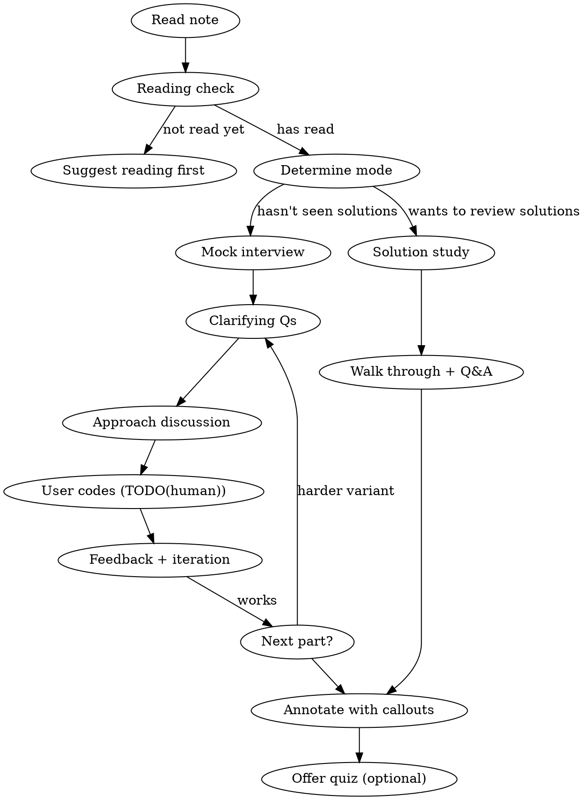

# Studying Coding Challenges

Interactive study flow for coding interview problems: confirm reading, run a mock session, annotate with callouts.

## Workflow

## Phase 0: Reading Check

1. Ask if they've read the **problem** (not solutions)
2. If not: suggest reading first. If yes: ask what's tricky — focuses the session.
3. **Mode:** No solutions seen → Mock interview. Has solutions → Solution study.

## Phase 1a: Mock Interview

Play interviewer. User codes; you facilitate and challenge.

**Step 1 — Clarifying Questions:** Let user ask. Answer as interviewer with concrete examples. If they skip: "Before you code — what would you ask an interviewer?"

**Step 2 — Approach Discussion:** Ask for data structures, algorithm choice, complexity. Give feedback without giving away the answer.

**Step 3 — User Codes:** Add `TODO(human)` in the note's code block. Frame with Learn by Doing format (Context / Your Task / Guidance). **Wait for their code.**

**Step 4 — Feedback:** Review like an interviewer — correctness, edge cases, complexity. Ask them to fix issues; give hints, not answers.

**Step 5 — Multi-Part:** Confirm readiness before next part. Repeat the full cycle (clarify → approach → code → feedback). Sections marked "for talking only" stay as discussion — don't ask for code.

## Phase 1b: Solution Study

Walk through solution pausing at key decisions. Ask "why this approach?" to test understanding. Discuss alternatives.

## Phase 2: Annotate

After session, add callouts to the note:

- `[!question]` conceptual Q&A, `[!warning]` gotchas/bugs, `[!info]` context/patterns, `[!example]` worked examples
- Place **contextually after relevant section**, not grouped at end
- One concept per callout, `==highlights==` for takeaways, no tables inside callouts
- Add `## My Solution` section before reference solutions with user's code
- AI disclosure after frontmatter: `> [!info] AI-assisted annotations`

## Phase 3: Quiz (Optional)

3-5 application questions: "What breaks if [change]?" "How would you modify for [constraint]?"

## Common Mistakes

| Mistake | Fix |
|---------|-----|
| Giving away the solution | Ask leading questions, don't state answers |
| Writing code for the user | Use TODO(human) + Learn by Doing |
| Skipping clarifying questions | Redirect: "What would you ask first?" |
| Callouts grouped at end | Place after relevant sections |
| Coding "discussion only" questions | Honor the note's labels |
| Missing AI disclosure | Always add after frontmatter |
| Summarizing problem back | They've read it — jump to engagement |
