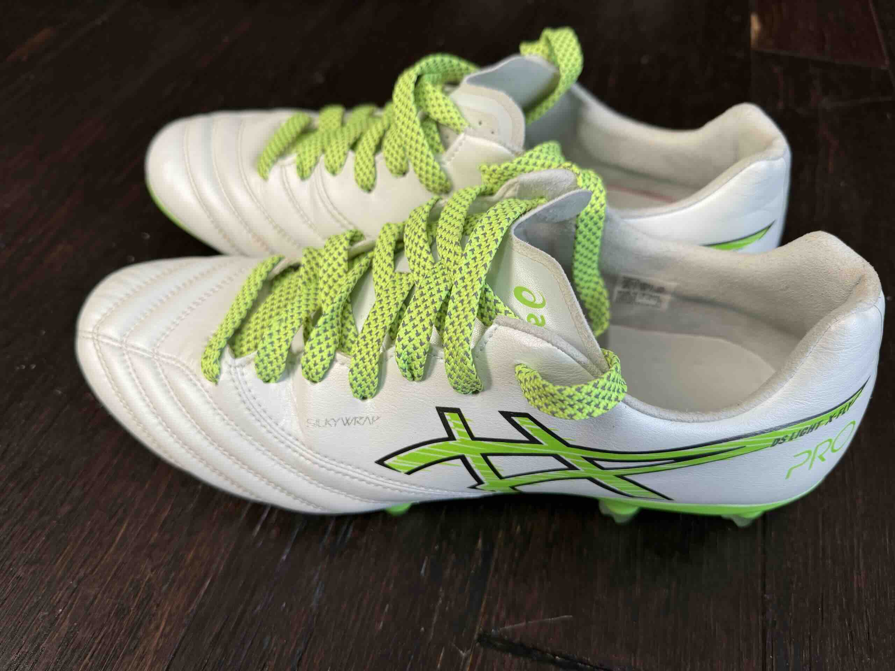
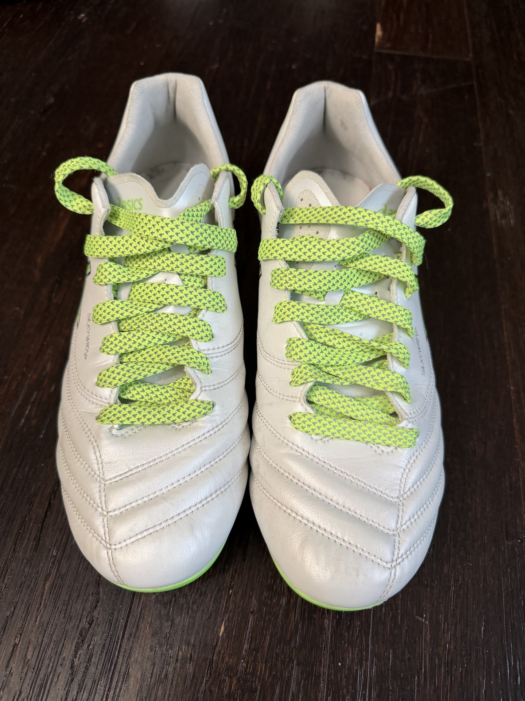
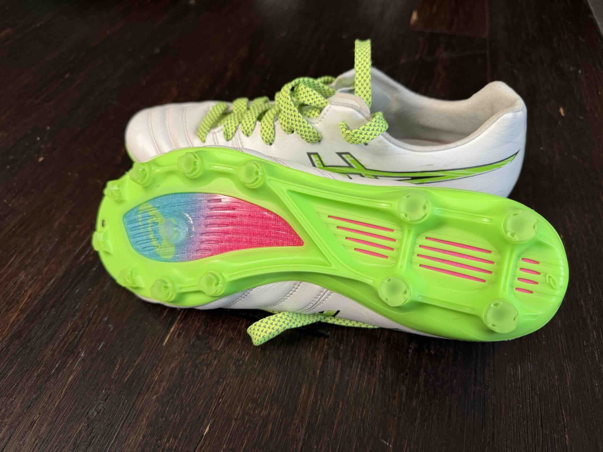

| Category | Size   | Rating | Purchase Date & Price       |
| -------- | ------ | ------ | --------------------------- |
| HG       | US 9.5 | ★★★★★  | [[20250606]]: $198.00 + tax |

I've been interested in ASICS soccer cleats since they're always highly regarded in YouTube review videos. However, for some reason the top-end models just aren't available in the US market, so you either have to pay extra through resellers or buy them somewhere in East Asia (apparently they're popular in Japan; you can get the latest models from Singapore; China is possible too but the inventory seems to be mostly previous generation and lagging behind) and bring them back. So when this pair became available on the US website, I immediately snapped one up.

They're not cheap—I ended up paying $200+. But what a pair of fantastic boots! Great fit, feel, and touch on the ball. The upper is as soft as K-leather but still feels super thin. At first I was a bit worried about the studs being too long for AG, and the website didn't mention anything about it. Now I've figured out it's an HG soleplate. Anyway, it performed superbly on AG—good firm grip even on a wet, slippery AG field here in PNW, and it doesn't feel too aggressive. I did replace the laces since the originals felt a bit...too simple.

---

_Edited by Claude (claude-sonnet-4-5-20250929)_
