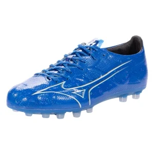
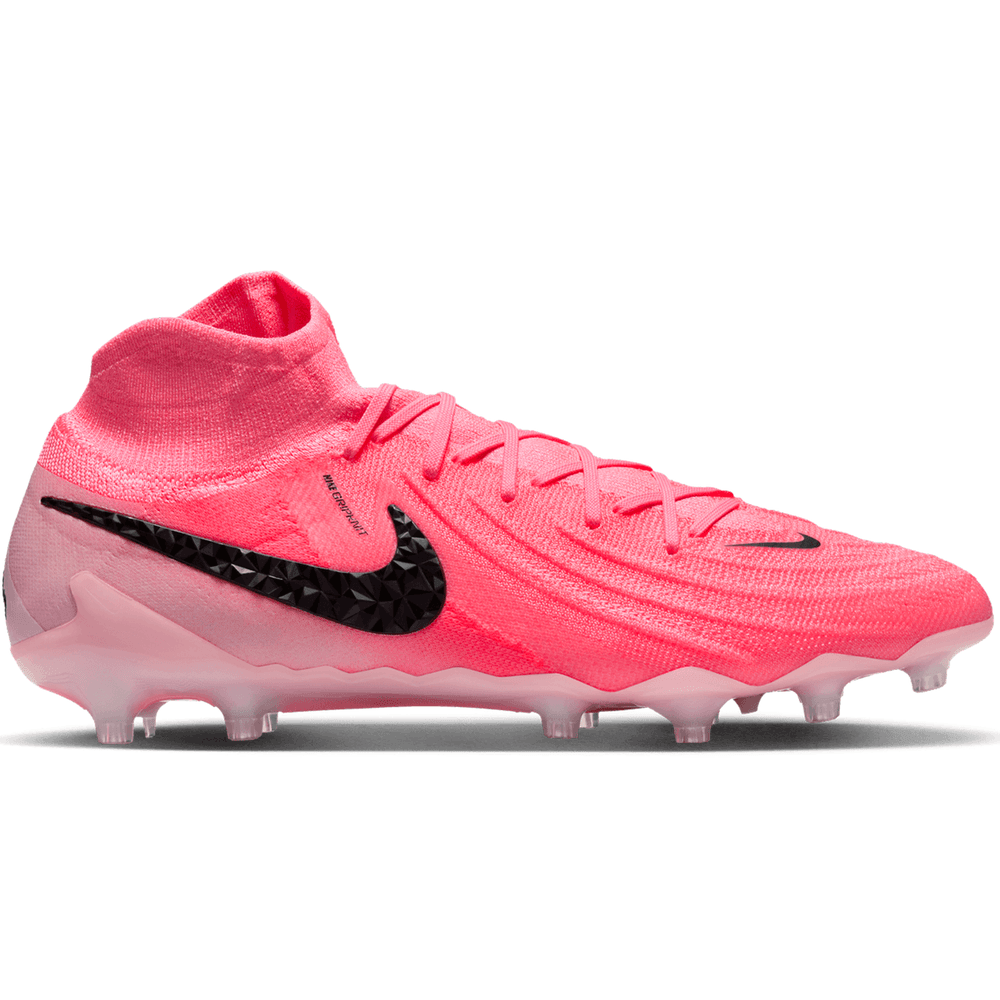
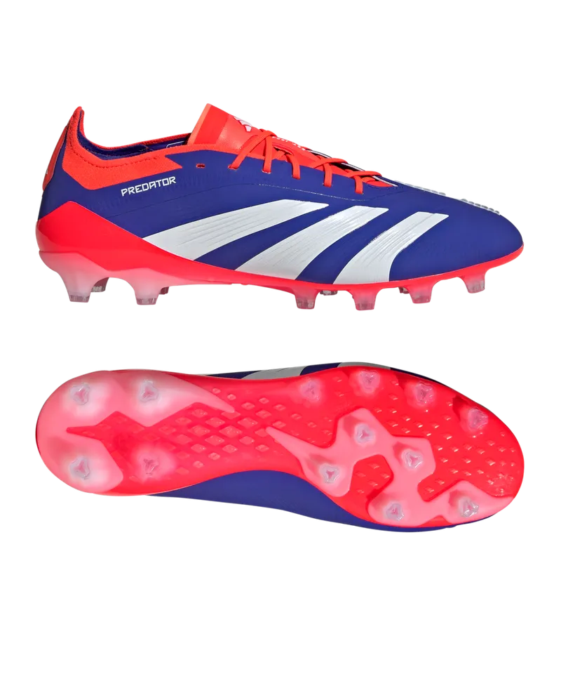

---
tags:
---

Ever since I started playing [soccer](../../writing/Soccer.md), I've wondered about the differences between soccer cleats. Of course, I also want a good pair to perform well on the field. But as a beginner, I've made lots of mistakes because soccer cleats can be really confusing. There are different types of studs for different playing surfaces, but you can't easily understand them unless you've tried playing with them—something that's not easy for a beginner. Even experienced players sometimes get confused; I've seen players using TF shoes on slippery AG fields. Because of this confusion, I've ended up collecting many pairs of soccer cleats (not always intentionally). I'm writing down my experiences here to record what I've learned along the way.

One of my biggest confusions in the beginning was choosing the right sole plate. I wanted to avoid injuries, especially knee injuries, so I first picked TF shoes. That turned out to be a big mistake because at the time I was playing with my kid on real grass fields, and those shoes were very slippery. It was fine for casual play with kids, but then I joined pickup games on AG fields. TF shoes worked okay at slow speeds but didn't provide enough traction for quick movements like accelerating or turning.

So, I switched to AG sole plates. The challenge was that not many brands offer shoes specifically made for AG fields. Usually, only Nike and Mizuno consistently have AG models available. Adidas does offer some AG models, but they don't cover their entire product range, and these shoes can be hard to find. Eventually, I discovered that FG shoes also work fine on AG surfaces if the studs are conical and not too long. This discovery allowed me to try many different brands—but then I ran into another problem.

Sizing! Each brand seems to have slightly different sizing, and I’m still confused about my exact foot size. Shopping online makes this even harder. Based on my experience and watching reviews online, here’s my current sizing guide:

1. Adidas - US 9.5: US 10 feels too long. The problem with Adidas is their shoes are usually narrow, making 9.5 hard to put on for many models.
2. Nike - US 10: Although sometimes there’s a bit of extra space in the toe box, the overall fit suits my wide feet much better. I might try 9.5 in the future, but for now, grip socks help fill the extra space.
3. New Balance - US 10
4. Mizuno - US 9.5 (275 CM)

---

| Category   | Model                                 | Size   | Grip Socks? | Rating | Purchase Date & Price                                                                        | Impressions                                                                                                                                                                                                 | Image                                                              |
| ---------- | ------------------------------------- | ------ | ----------- | ------ | -------------------------------------------------------------------------------------------- | ----------------------------------------------------------------------------------------------------------------------------------------------------------------------------------------------------------- | ------------------------------------------------------------------ |
| **TF**     | [[Nike Mercurial Vapor 15 Club Turf]] | US 9   | ❌          | ★★☆    | [[20230821]]: $59.99  **No Longer Owned**                                                 | First after-school pair with my kid. Runs small and the TF studs slip on natural grass. Mediocre, but sentimental.                                                                                          |   |
| **TF**     | adidas X Crazyfast.3 Turf             | US 9.5 | ❌          | ★★☆    | [[20240111]]: $71.25                                                                         | Too narrow and tough to pull on. Thin, stiff upper with little padding; traction weak, especially on damp night-time AG.                                                                                    |           |
| **TF**     | New Balance Furon v7 Dispatch TF Wide | US 10  | ❌          | ★★★☆   | [[20240319]]: $32.39                                                                         | Wide fit and plush padding feel great, but TF studs still lack bite on AG.                                                                                                                                  |  |
| **Indoor** | Nike Streetgato                       | US 10  | ❌          | ★★☆    | [[20240406]]: $74.97                                                                         | Most-worn this year. Sneaker look works for casual play, yet outsole gets slick when wet; unsure on true indoor courts.                                                                                     |                   |
| **FG**     | Lotto Stadio 200 III FG               | US 10  | —           | ★★     | [[20241027]]: $19.48                                                                         | Easy to slide on, but heel lockdown is weak and long studs feel clunky on AG. Floppy tongue—should’ve returned.                                                                                             |           |
| **FG**     | New Balance 442 v2 Pro FG Wide        | US 10  | ✅          | ★★★    | ~~[20241209](../journals/20241209.md): \$71.78~~ **Returned** [[20241218]]: \$62.41 + tax | Light and comfy. Conical FG studs okay on AG but a bit long. Heel still loose with grip socks. Limited waterproofing; studs slick in rain. Soleplate started separating after <10 AG sessions.              |         |
| **AG**     | Nike Phantom GX Academy               | US 10  | ❌          | ★★★    | [[20240227]]: $55.97                                                                         | First AG pair. Soft, padded, and the studs work well on AG—even in rain.                                                                                                                                    |           |
| **AG**     | Mizuno Alpha Elite AG                 | US 9.5 | ❌          | ★★★☆   | [[20240916]]: $113.99                                                                        | Narrow last plus grip socks and sticky liner make entry hard. Regular socks create toe space. Slightly narrow overall, but brilliant once on.                                                               |  |
| **AG**     | Nike Phantom Luna 2 Elite AG          | US 10  | ✅          | ★★★★★  | [20241108](../journals/20241108.md): \$112.92 (Mystery AG \$230+)                            | Lightweight, precise touch, secure heel, excellent traction. Extra toe room—grip socks help. Hard to slip on but superb in wet weather.                                                                     |      |
| **AG**     | adidas Predator Elite AG (2024)       | US 9.5 | ❌          | ★★★★★  | [[20250411]]: \$158.82                                                                       | Narrow, but the U-throat opens enough for my wider feet. Upper wraps the foot once laced. AG studs grip well despite aggressive look. Not the lightest, yet comfy for 4-mile pickup runs—now my go-to pair. |       |
