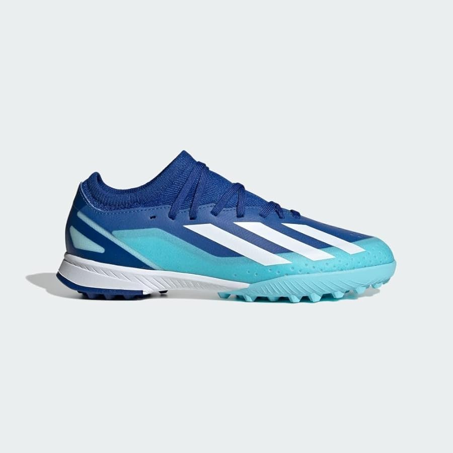
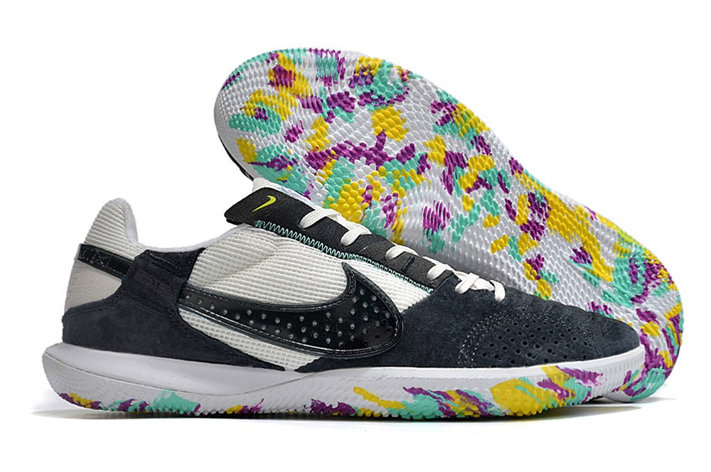
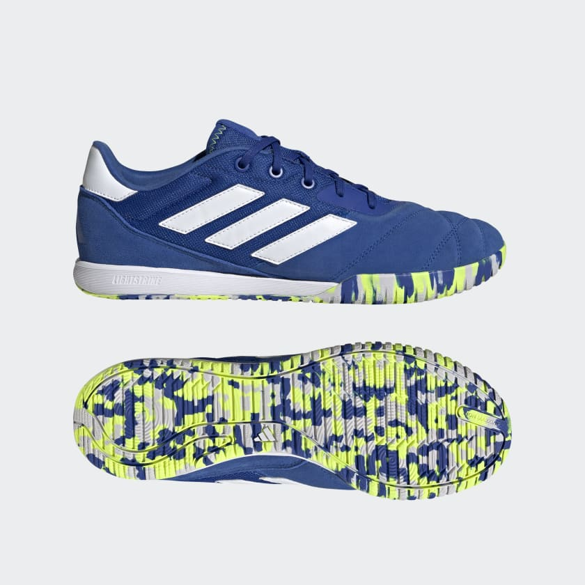
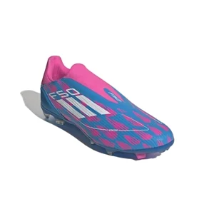
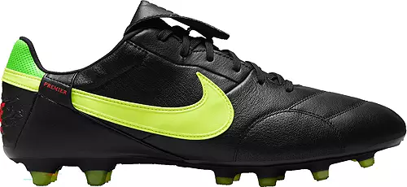
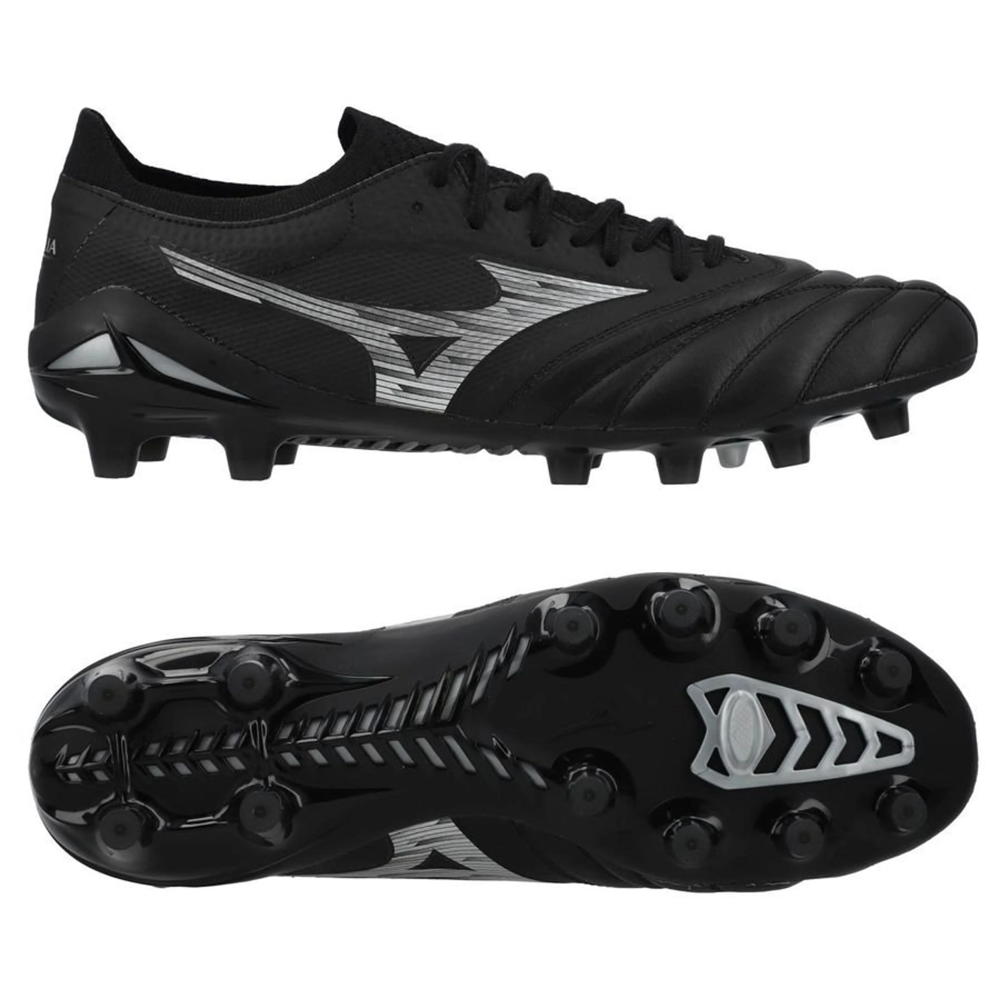
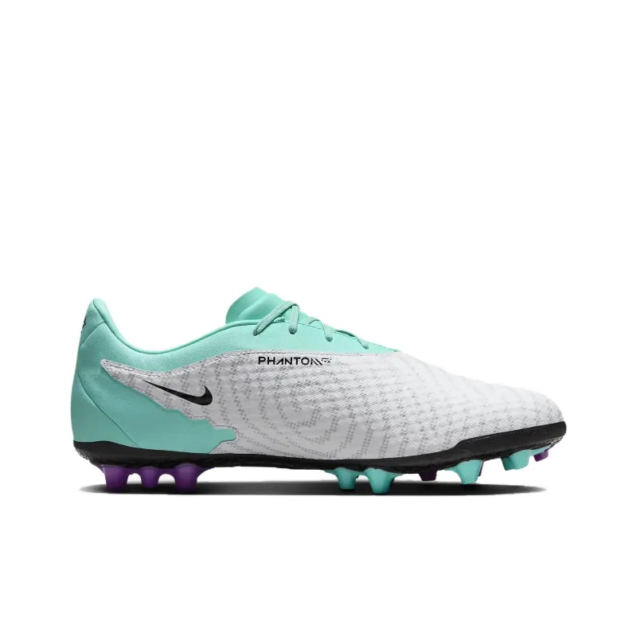
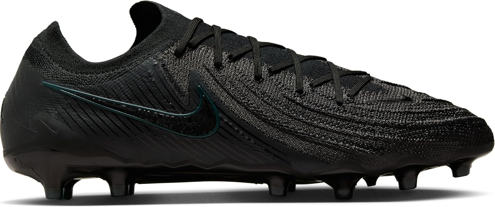
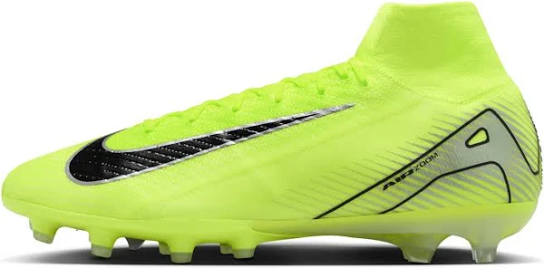

---
tags:
  - Life
---

Since I started playing [soccer](../../writing/Soccer.md), I’ve gradually built up a collection of football boots. Early on, I made quite a few missteps, which led me to learn more about boot differences—and that’s how my collection began.

---

| Category   | Model                                   | Rating | Purchase Date & Price                                                                        | Impressions                                                                                                                                                                                                                                                                                                 | Image                                                 |
| ---------- | --------------------------------------- | ------ | -------------------------------------------------------------------------------------------- | ----------------------------------------------------------------------------------------------------------------------------------------------------------------------------------------------------------------------------------------------------------------------------------------------------------- | ----------------------------------------------------- |
| **TF**     | Nike Mercurial Vapor 15 Club Turf       | ★★☆    | [[20230821]]: $59.99  **No Longer Owned**                                                 | This was my first pair when Jasper wanted to play daily. The size 9 was too small, and the TF studs performed poorly on natural grass. They were mediocre in quality, but I have fond memories of them.                                                                                                     |     |
| **TF**     | adidas X Crazyfast.3 Turf               | ★★☆    | [[20240111]]: $71.25                                                                         | Size 9.5 is too narrow and hard to put on. The stiff, thin upper lacks padding, and I didn’t feel enough grip from the plastic-like material. That might be because I played on AG at night and the ball got slippery with dew.                                                                             |             |
| **TF**     | New Balance Furon v7 Dispatch TF Wide   | ★★★☆   | [[20240319]]: $32.39                                                                         | My first New Balance boots. The wide fit suits broad feet well, and the comfortable padding is a big step up from my previous pairs. I didn’t realize back then that TF boots wouldn’t provide enough traction on AG surfaces.                                                                              |    |
| **Indoor** | Nike Streetgato                         | ★★☆    | [[20240406]]: $74.97                                                                         | My most-worn pair this year. They look like casual sneakers, and I often wore them to Jasper’s training sessions to get a few touches on the side. However, they can be slippery on wet surfaces, so I’m not sure how they’d perform on a true indoor court. Overall, they’re a convenient everyday option. |                     |
| **Indoor** | adidas Copa Gloro (Indoor)              |        | [[20241027]]: $34.48                                                                         | —                                                                                                                                                                                                                                                                                                           |            |
| **FG**     | Lotto Stadio 200 III FG                 | ★★     | [[20241027]]: $19.48                                                                         | Easy to slip on for wide feet, but the heel lockdown is poor. The heel studs are especially long and bulky on AG, and the tongue flaps around during play. I should’ve returned them despite the low price.                                                                                                 |             |
| **FG**     | New Balance 442 v2 Pro FG Wide          | ★★★☆   | ~~[20241209](../journals/20241209.md): \$71.78~~ **Returned** [[20241218]]: \$62.41 + tax | Comfortable and lightweight, with conical FG studs that work well on AG. The heel lockdown is weak but improves with a runner’s loop. They have limited water resistance, making them less ideal in heavy rain, and the studs get very slippery on wet surfaces.                                            |           |
| **FG**     | adidas F50 League Laceless FG/MG        | ★★★    | ~~[[20241129]]: $49.87~~ **Returned**                                                        | I didn’t like the laceless design, and it felt too narrow.                                                                                                                                                                                                                                                  |                   |
| **FG**     | Nike Premier 3 FG                       | ★★★☆   | ~~[20241214](../journals/20241214.md): \$62.75~~ **Returned**                                | They were comfortable, but I returned them in favor of an older K-leather version.                                                                                                                                                                                                                          |                      |
| **FG**     | Nike Premier III FG                     |        | [[20241224]]: €69.71 + shipping                                                              | A K-leather colorway from Unisports—pricier due to exchange rates and shipping, but it was the only place I could find this older version that ships to the US. I’m looking forward to trying them out.                                                                                                     |            |
| **FG**     | Mizuno Morelia Neo IV Beta Elite FG/AG  |        | [[20241224]]: €129.37 + shipping                                                             | I decided to try Mizuno again after reading positive reviews. I went with EU 43/UK 9, hoping for a better fit.                                                                                                                                                                                              |     |
| **FG**     | New Balance Tekela Pro V4+ Low          |        | [20241228](../journals/20241228.md): $88.58 + tax                                            | I returned a second pair of 442s and picked these up instead after hearing great things.                                                                                                                                                                                                                    |          |
| **AG**     | Nike Phantom GX Academy                 | ★★★    | [[20240227]]: $55.97                                                                         | These were my first AG boots. They’re decently soft and padded for a takedown model, with studs that feel good on AG and hold up well in the rain. Despite being cheaper than my later pairs, they’ve really grown on me.                                                                                   |             |
| **AG**     | Mizuno Alpha Elite AG                   | ★★☆    | [[20240916]]: $113.99                                                                        | I ordered a size 9.5, which turned out to be too small (Mizuno runs smaller than Nike/Adidas). They were painful for wide feet, and the thin “barefoot” upper isn’t my style. I missed the return window.                                                                                                   |    |
| **AG**     | Nike Phantom GX 2 Elite AG              |        | [[20241022]]: \$126.79 (Mystery AG \$230+)                                                   | They felt like a steal from Soccer.com’s mystery box. I haven’t worn them yet because I’m currently using the Phantom Luna 2 Elites.                                                                                                                                                                        |          |
| **AG**     | Nike Phantom Luna 2 Elite AG            | ★★★★★  | [20241108](../journals/20241108.md): \$112.92 (Mystery AG \$230+)                            | I initially assumed these were a women’s model, but they’re fantastic—lightweight, with a great touch, strong heel lockdown, and excellent traction without feeling too aggressive. They’re my current favorites.                                                                                           |        |
| **AG**     | Nike Mercurial Superfly 10 Elite AG-Pro |        | [[20241218]]: \$56.01 + tax (Mystery AG \$150+)                                              | I expected a Pro-level model but got an Elite instead. Now I’m hooked on size 10 mystery boxes from Soccer.com.                                                                                                                                                                                             |  |
