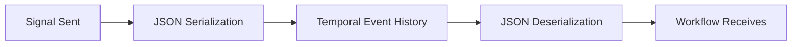
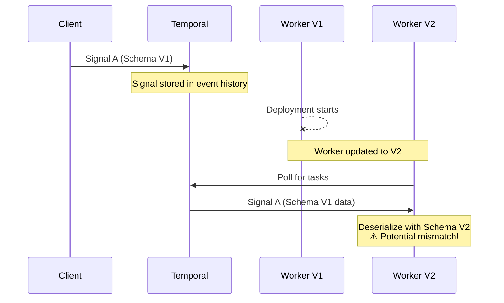
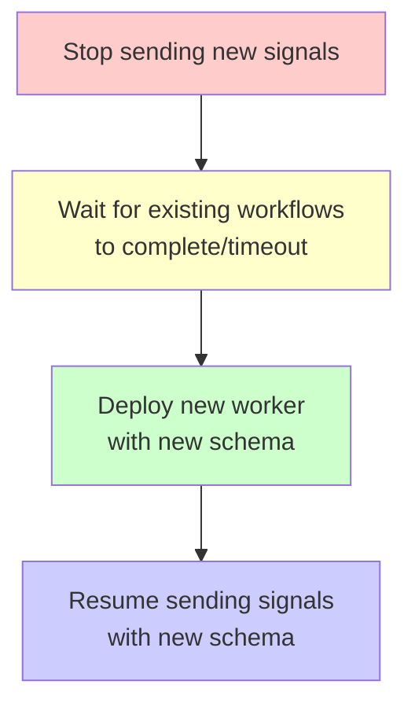

How it works:

1. Temporal uses a `DataConverter` (by default JSON, but can be configured to use protobuf) to serialize signal payloads
2. Signals are persisted in Temporal's event history as `WorkflowExecutionSignaled` events
3. When the workflow replays or receives the signal, Temporal deserializes using the same DataConverter

### Default Serialization (JSON)

By default, Temporal uses a **DataConverter** to serialize signal payloads. The default converter uses JSON:



When you call `SignalWithStartWorkflow` or `SignalWorkflow`, the signal payload is:

1. Serialized using the configured DataConverter (default: JSON)
2. Stored in Temporal's event history as a `WorkflowExecutionSignaled` event
3. Deserialized when the workflow receives and processes the signal

### Current Implementation

Our codebase uses a FIFO signal processing pattern:

Signals are defined as Go structs:

```go
// delivery_changes_signal.go
type DeliveryChangesSignal struct {
    WorkflowParam *workflowspb.ProcessWorkflowParams
    ReceivedAt    time.Time
}
```

The Temporal SDK automatically handles serialization when sending:

```go
// processor.go
signalPayload := &workflows.DeliveryChangesSignal{
    WorkflowParam: workflowParam,
    ReceivedAt:    time.Now(),
}

temporalClient.SignalWithStartWorkflow(
    ctx,
    workflowID,
    workflows.DeliveryChangesSignalName,
    signalPayload,  // Automatically serialized to JSON
    workflowOptions,
    workflows.DeliveryChangesWorkflow,
    deliveryChangesWorkflowParams,
)
```

And deserialization when receiving:

```go
// delivery_changes_workflow.go
func drainSignals(ctx workflow.Context, ch workflow.ReceiveChannel, state *deliveryChangesWorkflowState) {
    for {
        var signal DeliveryChangesSignal  // Automatically deserialized from JSON
        ok := ch.ReceiveAsync(&signal)
        if !ok {
            break
        }
        state.bufferedRequests = append(state.bufferedRequests, &signal)
    }
}
```

## Signal Versioning and Workflow Updates

### The Challenge

When a workflow is updated while signals are "in flight":



### What Can Go Wrong

| Change Type        | Risk Level | What Happens                               |
| ------------------ | ---------- | ------------------------------------------ |
| Add optional field | Low        | Old signals work, new field is zero-valued |
| Add required field | High       | Deserialization may fail or panic          |
| Remove field       | Medium     | Data loss, field ignored                   |
| Rename field       | High       | JSON key changes, data loss                |
| Change field type  | High       | Deserialization error                      |

### Safe Schema Changes

**Safe:**

```go
// V1
type DeliveryChangesSignal struct {
    WorkflowParam *workflowspb.ProcessWorkflowParams
    ReceivedAt    time.Time
}

// V2 - Adding optional field is safe
type DeliveryChangesSignal struct {
    WorkflowParam *workflowspb.ProcessWorkflowParams
    ReceivedAt    time.Time
    Priority      int  // New optional field, defaults to 0
}
```

**Unsafe:**

```go
// V1
type DeliveryChangesSignal struct {
    WorkflowParam *workflowspb.ProcessWorkflowParams
    ReceivedAt    time.Time
}

// V2 - Renaming breaks existing signals!
type DeliveryChangesSignal struct {
    Params     *workflowspb.ProcessWorkflowParams  // BREAKS: JSON key changed
    ReceivedAt time.Time
}
```

## Best Practices

### 1. Use Protobuf for Signal Payloads

Protobuf provides better forward/backward compatibility than JSON:

```protobuf
message DeliveryChangesSignal {
  ProcessWorkflowParams workflow_param = 1;
  google.protobuf.Timestamp received_at = 2;
}
```

Benefits:

- Field numbers provide stable serialization (not field names)
- Built-in support for optional fields
- Clear deprecation semantics
- Cross-language compatibility

### 2. Never Remove or Reuse Field Numbers

```protobuf
// BAD - Reusing field number 2
message DeliveryChangesSignal {
  ProcessWorkflowParams workflow_param = 1;
  // reserved 2;  // Should reserve removed fields
  string new_field = 2;  // DANGER: Reusing field number!
}

// GOOD - Reserve removed fields
message DeliveryChangesSignal {
  ProcessWorkflowParams workflow_param = 1;
  reserved 2;  // Previously: received_at
  string new_field = 3;
}
```

### 3. Use Feature Flags for Rollout

```go
// processor.go
if enabled, err := p.rouletteProvider.RouletteEnabled("oof_execute_from_request_async_enabled"); err == nil && enabled {
    // Use new async signal-based processing
} else {
    // Fallback to synchronous execution
}
```

### 4. Drain Workflows Before Breaking Changes

Before deploying breaking signal schema changes:



Steps:

1. Stop sending new signals with old schema
2. Wait for existing workflows to complete (idle timeout)
3. Deploy new worker with new schema
4. Resume sending signals with new schema

### 5. Version Signal Names for Breaking Changes

If you must make a breaking change, use a new signal name:

```go
const DeliveryChangesSignalNameV1 = "DeliveryChanges"
const DeliveryChangesSignalNameV2 = "DeliveryChangesV2"
```

## Workflow Versioning with `workflow.GetVersion()`

For workflow logic changes (not signal schema), use Temporal's versioning:

```go
// workflow.go
publishPostExecutionEventsVersion := workflow.GetVersion(
    ctx,
    "publishPostExecutionEvents",
    workflow.DefaultVersion,
    0,
)
if publishPostExecutionEventsVersion > workflow.DefaultVersion {
    publishPostExecutionEvents(ctx, params, revisionResult)
}
```

This ensures:

- Running workflows continue with the logic version when they started
- New workflows use the latest logic
- Replay is deterministic

## Debugging Signal Issues

### Check Signal Payload in Temporal UI

1. Go to Temporal Web UI
2. Find the workflow execution
3. Look for `WorkflowExecutionSignaled` events
4. Examine the `Input` field for the serialized payload

### Common Errors

**"failed to deserialize signal"**

- Signal schema mismatch between sender and receiver
- Check if recent deployments changed signal struct

**Signal received but not processed**

- Signal name mismatch
- Check `DeliveryChangesSignalName` constant

**Nil pointer in signal handler**

- Optional fields not set in old signals
- Add nil checks before accessing nested fields

## References

- [Temporal Signals Documentation](https://docs.temporal.io/workflows#signal)
- [Temporal Data Converters](https://docs.temporal.io/dataconversion)
- [Protobuf Backward Compatibility](https://protobuf.dev/programming-guides/dos-donts/)

---

Temporal Signal Serialization

In this codebase (delivery_changes_signal.go), signals are defined as:
type DeliveryChangesSignal struct {
WorkflowParam \*workflowspb.ProcessWorkflowParams // Protobuf message
ReceivedAt time.Time
}

The Temporal SDK handles serialization automatically when you call SignalWithStartWorkflow (processor.go:257-265).

What Happens with In-Flight Signals During Workflow Updates

This is a critical concern. There are two scenarios:

4. Signal Payload Schema Changes

If you change the signal struct (add/remove/rename fields):

- Signals already in the queue were serialized with the OLD schema
- New worker tries to deserialize with the NEW schema
- Result: Deserialization may fail or lose data depending on the change

Safe changes:

- Adding new optional fields (with defaults)
- Using protobuf with proper field numbering (never reuse deleted field numbers)

Unsafe changes:

- Renaming fields (JSON keys change)
- Removing required fields
- Changing field types

2. Workflow Logic Changes

This codebase uses workflow.GetVersion() for safe migrations (workflow.go:408):
publishPostExecutionEventsVersion := workflow.GetVersion(ctx, "publishPostExecutionEvents", workflow.DefaultVersion, 0)
if publishPostExecutionEventsVersion > workflow.DefaultVersion {
publishPostExecutionEvents(ctx, params, revisionResult)
}

For signals specifically:

- Running workflows continue with the logic version when they started
- New signals to existing workflows are processed with the workflow's current version
- GetVersion lets you branch behavior based on when the workflow started

Best Practices for Signal Versioning

1. Use protobuf - Better forward/backward compatibility than JSON
2. Never remove or rename fields - Add new fields, deprecate old ones
3. Use feature flags - This codebase uses oof_execute_from_request_async_enabled for safe rollout
4. Drain existing workflows - Let old workflows complete before removing old signal handling code
5. Version the signal name - If making breaking changes, use a new signal name entirely (e.g., DeliveryChangesV2)
