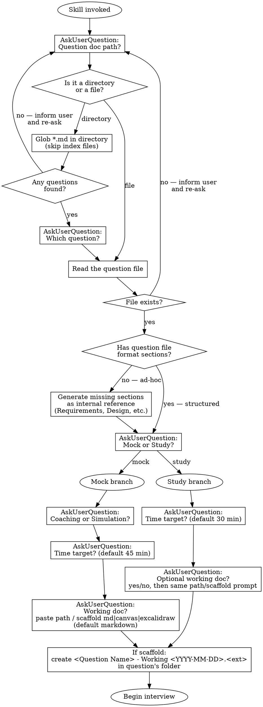
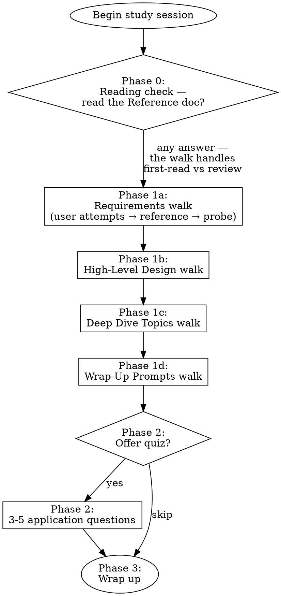

# Studying System Design Challenges Implementation Plan

> **For agentic workers:** REQUIRED SUB-SKILL: Use superpowers:subagent-driven-development (recommended) or superpowers:executing-plans to implement this plan task-by-task. Steps use checkbox (`- [ ]`) syntax for tracking.

**Goal:** Rename `mock-system-design-interview` to `studying-system-design-challenges`, add a `study` mode alongside existing `mock` mode, and introduce a working doc the agent reads at step transitions in three formats (markdown, canvas, excalidraw).

**Architecture:** The skill exists as byte-identical SKILL.md copies in `.claude/skills/` and `.agents/skills/`. Edit pattern: edit in `.claude/`, sync to `.agents/` via `cp`, verify with `diff -r` after each task. No worktrees (Dropbox-synced repo — direct work on `v4`). Each task is a coherent commit on `v4`.

**Tech Stack:** Markdown (SKILL.md), Graphviz dot for flowcharts, Obsidian CLI for vault file operations during the skill's runtime.

**Source Spec:** `docs/superpowers/specs/2026-05-03-studying-system-design-challenges-design.md`

**Sync Helper Command** (used in every task that edits the skill):

```bash
rm -rf .agents/skills/studying-system-design-challenges
cp -R .claude/skills/studying-system-design-challenges .agents/skills/studying-system-design-challenges
diff -r .claude/skills/studying-system-design-challenges .agents/skills/studying-system-design-challenges && echo "synced"
```

---

## Task 1: Rename Directories

**Files:**

- Rename: `.claude/skills/mock-system-design-interview/` → `.claude/skills/studying-system-design-challenges/`
- Rename: `.agents/skills/mock-system-design-interview/` → `.agents/skills/studying-system-design-challenges/`

- [ ] **Step 1: Verify starting state is clean**

```bash
git status
# Expected: clean working tree on v4
diff -r .claude/skills/mock-system-design-interview .agents/skills/mock-system-design-interview
# Expected: no output (byte-identical)
```

- [ ] **Step 2: Rename both directories**

```bash
git mv .claude/skills/mock-system-design-interview .claude/skills/studying-system-design-challenges
git mv .agents/skills/mock-system-design-interview .agents/skills/studying-system-design-challenges
```

- [ ] **Step 3: Verify byte-identity preserved**

```bash
diff -r .claude/skills/studying-system-design-challenges .agents/skills/studying-system-design-challenges
# Expected: no output
```

- [ ] **Step 4: Commit**

```bash
git add -A .claude/skills .agents/skills
git commit -m "$(cat <<'EOF'
rename mock-system-design-interview to studying-system-design-challenges

Co-Authored-By: Claude Opus 4.7 <noreply@anthropic.com>
EOF
)"
```

---

## Task 2: Update Frontmatter and Overview

**Files:**

- Modify: `.claude/skills/studying-system-design-challenges/SKILL.md` (lines 1-10)
- Then sync to `.agents/skills/studying-system-design-challenges/SKILL.md`

- [ ] **Step 1: Replace frontmatter and Overview block**

Old content (lines 1-10):

```markdown
---
name: mock-system-design-interview
description: Use when user wants to practice system design interviews, do mock interview prep, or walk through a system design question interactively
---

# Mock System Design Interview

## Overview

Interactive mock interviewer for system design questions. Follows the 4-step framework from "System Design Interview — An Insider's Guide." Two modes: **coaching** (educational, progressive hints) and **simulation** (realistic, minimal help).
```

New content:

```markdown
---
name: studying-system-design-challenges
description: Use when studying system design interview problems in the Obsidian vault — user wants to run a mock system design interview, study a reference design, or annotate a system design question note with learning callouts.
---

# Studying System Design Challenges

## Overview

Interactive study flow for system design interview problems. Two top-level modes: **mock** (live interview, follows the 4-step framework from "System Design Interview — An Insider's Guide") and **study** (walks an existing reference design section by section). Mock mode has two sub-modes: **coaching** (educational, progressive hints) and **simulation** (realistic, minimal help). Both modes optionally read a working doc as you draw/type — markdown, Obsidian Canvas, or Excalidraw.
```

- [ ] **Step 2: Sync to .agents/**

Run the Sync Helper Command from the header.

- [ ] **Step 3: Commit**

```bash
git add -A .claude/skills .agents/skills
git commit -m "$(cat <<'EOF'
update frontmatter and overview for new mode + working-doc

Co-Authored-By: Claude Opus 4.7 <noreply@anthropic.com>
EOF
)"
```

---

## Task 3: Update Setup Section

**Files:**

- Modify: `.claude/skills/studying-system-design-challenges/SKILL.md` (the entire `## Setup` section)
- Then sync to `.agents/`

- [ ] **Step 1: Replace the Setup section**

Find the existing `## Setup` section (starts at line 12 in the original, ends right before `## Modes`). Replace the entire section with:

````markdown
## Setup



When invoked:

1. **Which question?** Use AskUserQuestion to ask for the path to a question document. The user can:
   - Provide a path to a specific `.md` file anywhere in the vault
   - Provide a path to a directory to list questions from — glob for `*.md` files, exclude index files, mock session retros (`- Mock Session`), and companion docs (`- Question`, `- Reference`), then ask which one
   - **If the directory is empty** (no `.md` question files), inform the user and re-ask
   - **If the file doesn't exist**, inform the user and re-ask
2. **Which top-level mode?** `mock` or `study`
3. **Mock-only sub-mode:** `coaching` or `simulation`
4. **Time target?** Default 45 min for mock, 30 min for study
5. **Working doc?** Ask the user:
   - `paste path` — provide a path to an existing `.md`, `.canvas`, or `.excalidraw.md` file
   - `scaffold` — choose `markdown` (default), `canvas`, or `excalidraw`. The skill creates `<Question Name> - Working <YYYY-MM-DD>.<ext>` in the same folder as the question file via the Obsidian CLI.
   - In **study mode**, this question is prefaced with "Want a doc to sketch as we discuss? (yes/no)" — `no` skips it.

Read the selected question file. If the file follows the question file format (has `## Requirements`, `## High-Level Design`, etc.), proceed directly. If it's an ad-hoc source (notes, articles, clippings), **generate the missing structure first** — silently create internal reference sections (Requirements, Back-of-Envelope, High-Level Design, Deep Dive Topics, Wrap-Up Prompts, Common Mistakes) based on the file's content and your own domain knowledge. Then begin the session using this generated structure as your reference.
````

- [ ] **Step 2: Sync to .agents/**

Run the Sync Helper Command.

- [ ] **Step 3: Commit**

```bash
git add -A .claude/skills .agents/skills
git commit -m "$(cat <<'EOF'
add mode + working-doc to setup flow

Co-Authored-By: Claude Opus 4.7 <noreply@anthropic.com>
EOF
)"
```

---

## Task 4: Add Working Doc Section

**Files:**

- Modify: `.claude/skills/studying-system-design-challenges/SKILL.md` (insert new section after the Setup section, before `## Modes`)
- Then sync to `.agents/`

- [ ] **Step 1: Insert Working Doc section**

Insert this entire section between the end of `## Setup` and `## Modes`:

```markdown
## Working Doc

The working doc is what the candidate draws / types into during the session. The interviewer (you) reads it at well-defined beats — not every turn — to avoid token waste while still mimicking interviewer behavior of glancing at the candidate's diagram.

### Read Cadence

| When                                                                         | Trigger        |
| ---------------------------------------------------------------------------- | -------------- |
| Session start (see if user pre-populated)                                    | Auto, one-time |
| Step transitions: Requirements → HLD → Deep Dive → Wrap-up                   | Auto           |
| User says "look at the doc" / "look at my diagram" / "I just added X"        | On request     |
| User says "as you can see here" or other natural cue referencing the diagram | On request     |

Do NOT re-read the doc on every candidate turn. The defaults above are sufficient.

### Format-Specific Reading

| Format                        | How you read it                                                                                                                                                                                                                  |
| ----------------------------- | -------------------------------------------------------------------------------------------------------------------------------------------------------------------------------------------------------------------------------- |
| Markdown (`.md`)              | Read the file directly with the Read tool. Cheap; the full content is plain text.                                                                                                                                                |
| Canvas (`.canvas`)            | Read the file as JSON. Extract `nodes[]` (boxes with `text` / `file` properties) and `edges[]` (`fromNode` → `toNode` connections). Reason about layout from coordinates only when needed.                                       |
| Excalidraw (`.excalidraw.md`) | **Default:** Read the file and locate the `## Text Elements` section maintained by the Obsidian Excalidraw plugin. This gives you every text label without spatial info.                                                         |
|                               | **At step transitions and on request:** Prompt the candidate: "Go ahead and export the diagram so I can take a look — `Cmd+P` → Export PNG, save it as `<same-basename>.png` in the same folder." Then read the PNG with vision. |
|                               | **Fallback:** If the PNG is missing, stale, or the candidate skips export, fall back to labels-only and disclose: "I can see your labels but not the spatial layout — walk me through the connections."                          |

### Doc Path Convention

- Scaffolded path: `<Question Name> - Working <YYYY-MM-DD>.<ext>` in the same folder as the question file.
- PNG export path (Excalidraw only): same folder, same basename, `.png` extension.
- Use the Obsidian CLI for create / move / rename / delete to keep the link graph healthy.
```

- [ ] **Step 2: Sync to .agents/**

Run the Sync Helper Command.

- [ ] **Step 3: Commit**

```bash
git add -A .claude/skills .agents/skills
git commit -m "$(cat <<'EOF'
add working doc reading rules (md/canvas/excalidraw)

Co-Authored-By: Claude Opus 4.7 <noreply@anthropic.com>
EOF
)"
```

---

## Task 5: Restructure Modes Section and Add Study Mode

**Files:**

- Modify: `.claude/skills/studying-system-design-challenges/SKILL.md` (rename/restructure the Modes section, add Study Mode workflow)
- Then sync to `.agents/`

- [ ] **Step 1: Rename `## Modes` and split it**

Replace the existing `## Modes` section (which has Coaching and Simulation as sub-headings) with:

```markdown
## Mock Mode

The live interview experience. Two sub-modes:

### Coaching Sub-Mode

- After each candidate response, provide brief feedback on what was strong/weak
- Give **progressive hints** (see hint levels below) when the candidate is stuck or missing key topics
- Explain what a strong answer looks like AFTER the candidate has attempted each step
- Call out red flags gently with guidance: "An interviewer would want to see X here"
- Full debrief at end with learning recommendations

### Simulation Sub-Mode

- Behave as a realistic interviewer — no teaching during the interview
- Use subtle nudges only: "Anything else you'd want to clarify?" or "Are there other approaches?"
- Do NOT reveal expected answers during the interview
- Full evaluation at end with detailed scoring

Mock mode follows the **4-Step Framework** below. The Working Doc is read at each step transition (see Working Doc section).
```

- [ ] **Step 2: Add `## Study Mode` section after the existing `## The 4-Step Framework`**

The 4-Step Framework section is mock-only and stays as is. Insert this new section AFTER the entire 4-Step Framework section (which ends with the Step 4 - Wrap Up subsection) and BEFORE `## Progressive Hint System (Coaching Mode Only)`:

````markdown
## Study Mode

Walks the question's **Reference doc** (the `<Name> - Reference.md` companion the post-session flow generates) section by section. The candidate attempts each section first; you then share the reference and probe alternatives.



### Phase 0 — Reading Check

Ask: "Have you read the Reference doc, or should we walk it together cold?"

- **Cold:** the session is a guided first read — share the reference content as we walk
- **Already read:** focus on weak parts; let the candidate attempt before you share the reference

### Phase 1 — Section Walk

Walk the Reference doc's sections in this order, pausing at each:

1. **Requirements & scale numbers** — "Why these numbers? What changes if traffic 10x?"
2. **High-Level Design** — "Why this component? What's the alternative?"
3. **Each Deep Dive Topic** — "Walk me through the tradeoff. What would push you the other way?"
4. **Wrap-Up Prompts (failure scenarios)** — "How does this design degrade under [scenario]?"

For each section: ==let the candidate attempt the answer first, then share what the reference says, then probe alternatives==.

The Working Doc is **optional** in study mode — useful if the candidate wants to sketch comparisons mid-discussion. Same read cadence rules apply.

### Phase 2 — Quiz (Optional)

3-5 application questions: "What breaks if [constraint changes]?", "How would you modify the design for [new requirement]?". Same shape as `studying-coding-challenges` Phase 4.

### Phase 3 — Wrap Up

Lighter than mock-mode wrap-up. See the **Post-Session: Wrap Up** section below — study mode skips the evaluation rubric and hire decision.
````

- [ ] **Step 3: Update the 4-Step Framework section header**

Find the existing `## The 4-Step Framework` and add a "Mock Mode" qualifier:

```markdown
## The 4-Step Framework (Mock Mode)
```

Then immediately after that header, before the existing flowchart, insert this paragraph:

```markdown
This framework applies to **mock mode only**. Study mode uses the section walk in `## Study Mode` above. Both modes read the Working Doc at step / phase transitions.
```

- [ ] **Step 4: Sync to .agents/**

Run the Sync Helper Command.

- [ ] **Step 5: Commit**

```bash
git add -A .claude/skills .agents/skills
git commit -m "$(cat <<'EOF'
split mock/study modes; add study mode section walk

Co-Authored-By: Claude Opus 4.7 <noreply@anthropic.com>
EOF
)"
```

---

## Task 6: Update Wrap-Up Section

**Files:**

- Modify: `.claude/skills/studying-system-design-challenges/SKILL.md` (the `## Post-Session: Wrap Up` section)
- Then sync to `.agents/`

- [ ] **Step 1: Replace the wrap-up intro**

Find: `## Post-Session: Wrap Up` followed by `Run this immediately after the evaluation debrief. All four steps are mandatory.`

Replace with:

```markdown
## Post-Session: Wrap Up

Run this immediately after the evaluation debrief (mock mode) or the section walk (study mode). All steps below are mandatory. The wrap-up has six phases: working doc handling (new), then the existing 2a–2e.
```

- [ ] **Step 2: Insert new working-doc handling step (2-doc) before 2a**

Insert this new subsection between the wrap-up intro and `### 2a: Annotate Question File (metadata only)`:

```markdown
### 2-doc: Working Doc Handling

If a Working Doc was used during the session, ask the candidate:

> "Working doc — keep / discard / rename?"

- `keep` — leave it in the question's folder. The mock session retro (2b) wikilinks to it.
- `discard` — delete via the Obsidian CLI (`obsidian delete vault=content path="..."`). The retro records the choice ("Working doc discarded") but does not wikilink.
- `rename` — ask for the new name, move via `obsidian move` (or `obsidian rename` for in-place rename). The retro wikilinks to the renamed file.

If no working doc was used, skip this step.
```

- [ ] **Step 3: Update 2b to be mode-aware**

Find the existing `### 2b: Create/Update Mock Session Retro` section and replace with:

```markdown
### 2b: Create/Update Session Retro

Create a retro note in the **same folder** as the question file. The retro structure differs by mode:

#### Mock Mode Retro

- **Filename:** `<Question Name> - Mock Session <YYYY-MM-DD>.md`
- **Structure:**
  - Setup block (question wikilink, mode = `mock`, sub-mode = `coaching` | `simulation`, time target, date, working-doc wikilink if kept/renamed)
  - Per-step sections with:
    - What the candidate said/did
    - Study callouts placed **contextually after the relevant step** they relate to:
      - `[!question]` conceptual Q&A and key insights, `[!warning]` gotchas/mistakes, `[!info]` context/patterns, `[!example]` strong points
      - One concept per callout, `==highlights==` for takeaways, no tables inside callouts
  - Evaluation summary table (dimension, score, notes)
  - Priority areas for next session
  - Comparison to previous sessions (if any exist — check for prior mock session files)

#### Study Mode Retro

- **Filename:** `<Question Name> - Study Session <YYYY-MM-DD>.md`
- **Structure:**
  - Setup block (question wikilink, mode = `study`, time target, date, working-doc wikilink if kept/renamed, reference-doc wikilink)
  - Per-section notes (Requirements / HLD / Deep Dive Topics / Wrap-Up Prompts):
    - What the candidate attempted
    - What the reference added
    - Alternatives discussed
  - Study callouts placed **contextually after the relevant section** (same callout types as mock mode)
  - Key insights to remember
  - Comparison to prior sessions for this question (if any exist)
  - **No** evaluation rubric, **no** hire decision

If prior session retros exist in the same folder, use them as format reference.
```

- [ ] **Step 4: Update 2c to note mode**

Find `### 2c: Update System Design Retro Journal` and replace with:

```markdown
### 2c: Update System Design Retro Journal

Find the System Design Retro Journal in the Interview Preparation folder. If it doesn't exist, create it (modeled on Coding Retro Journal). Add an entry following its template format, including a `mode: mock | study` field, with a wikilink to the full session retro note.

Also update the **Weak Pattern Summary** table at the bottom — patterns that recur across sessions get flagged here. Mock-mode and study-mode patterns can share rows when they touch the same weakness.
```

- [ ] **Step 5: Update 2d to note mode focus**

Find `### 2d: Create Anki Cards` and replace with:

```markdown
### 2d: Create Anki Cards

Invoke the `accelerated-learning:creating-anki-cards` skill to create flashcards from the session. Cards go in the project's `anki/` directory. Deck naming convention: `"Interview Prep::System Design::<Topic>"`.

**Mock mode focus:**

- Gotchas and mistakes made during the session
- Key formulas and estimation patterns
- Tradeoffs and design decisions
- Interview technique insights
- Patterns that generalize beyond this specific question

**Study mode focus:**

- The **why** of each design choice (tradeoffs, alternatives the reference rejected)
- Failure-mode reasoning (how the design degrades, what breaks first)
- Numbers from estimation and what they imply for component choice
- Patterns that generalize beyond this specific question

Check existing YAML files to avoid duplicates; add to existing file if the topic already has one.
```

- [ ] **Step 6: Sync to .agents/**

Run the Sync Helper Command.

- [ ] **Step 7: Commit**

```bash
git add -A .claude/skills .agents/skills
git commit -m "$(cat <<'EOF'
update wrap-up: working doc handling + mode-aware retro

Co-Authored-By: Claude Opus 4.7 <noreply@anthropic.com>
EOF
)"
```

---

## Task 7: Update Red Flags / Common Mistakes for New Behaviors

**Files:**

- Modify: `.claude/skills/studying-system-design-challenges/SKILL.md` (the `## Red Flags (Across All Steps)` section)
- Then sync to `.agents/`

- [ ] **Step 1: Append working-doc and study-mode red flags**

Find the existing `## Red Flags (Across All Steps)` section and append these bullets to the end (keep the existing bullets):

```markdown
- Re-reading the working doc on every candidate turn → only at step transitions and on explicit request
- Forgetting to prompt for PNG export at HLD → Deep Dive transition (Excalidraw) → ask the candidate to export so you can see the spatial layout
- Treating Excalidraw labels-only as full-vision → if you only have labels, disclose explicitly: "I can see labels but not connections — walk me through them"
- Skipping the working-doc handling step at wrap-up → always ask keep/discard/rename if a doc was used
- Running the mock-mode evaluation rubric in study mode → study mode has no rubric and no hire decision
- Walking the Reference doc in mock mode → mock mode is a live design session, not a reference walk; the reference is your private answer key, not the candidate's
```

- [ ] **Step 2: Sync to .agents/**

Run the Sync Helper Command.

- [ ] **Step 3: Commit**

```bash
git add -A .claude/skills .agents/skills
git commit -m "$(cat <<'EOF'
add red flags for working doc and study mode

Co-Authored-By: Claude Opus 4.7 <noreply@anthropic.com>
EOF
)"
```

---

## Task 8: Verification

**Files:**

- No file changes — verification only.

- [ ] **Step 1: Verify byte-identity of both skill copies**

```bash
diff -r .claude/skills/studying-system-design-challenges .agents/skills/studying-system-design-challenges
# Expected: no output
```

- [ ] **Step 2: Verify the old skill name is fully removed**

```bash
grep -r "mock-system-design-interview" .claude .agents content
# Expected: no matches
```

- [ ] **Step 3: Verify SKILL.md frontmatter is well-formed**

```bash
head -5 .claude/skills/studying-system-design-challenges/SKILL.md
# Expected:
# ---
# name: studying-system-design-challenges
# description: Use when studying system design interview problems ...
# ---
#
```

- [ ] **Step 4: Read the full SKILL.md as a fresh agent would**

Read the entire `.claude/skills/studying-system-design-challenges/SKILL.md` end to end. Look for:

- Coherent narrative from setup → mode-specific flow → wrap-up
- No stale references to `mock-system-design-interview`
- No orphaned headings (e.g., `## Modes` referenced but not present)
- Setup flowchart matches the numbered-list setup steps
- Working Doc section appears once and is referenced from both Mock Mode and Study Mode
- All five wrap-up steps (2-doc, 2a, 2b, 2c, 2d, 2e) are present and in order

Fix any gaps inline; if you make any fix, re-run Step 1 and re-commit with message `fix: <what you fixed>`.

- [ ] **Step 5: Pressure test the skill with a subagent (optional but recommended)**

Dispatch a fresh subagent via the Agent tool with this prompt:

> "I want to study a system design problem in study mode. The question file is at `content/private/system-design-questions/<pick-any-existing>.md`. Walk me through how you'd run the session — what's the first thing you ask, what's the second, where does the Reference doc come in, and what does the wrap-up look like? Do not actually start the session — describe the flow."

The subagent should produce a flow that:

- Starts by confirming the question path and asking mode
- Picks `study`, asks time target (default 30 min)
- Offers an optional working doc
- Walks Reference doc Requirements → HLD → Deep Dive Topics → Wrap-Up Prompts
- Wraps up with no rubric, lighter retro, mode noted in journal

If the subagent's flow is wrong, the SKILL.md is unclear — go back and fix.

- [ ] **Step 6: Final commit (if any inline fixes happened in Step 4 or Step 5)**

```bash
git status
# If clean: skip this step.
# If dirty: stage + commit with a fix-style message, then re-sync .agents/ first.
```

- [ ] **Step 7: Update auto-memory**

The user's auto-memory at `~/.claude/projects/-Volumes-HyperMac-Dropbox-Vaults-quartz/memory/MEMORY.md` may reference the old skill name. Check and update if needed:

```bash
grep -i "mock-system-design\|studying-system-design" /Users/ziyunli/.claude/projects/-Volumes-HyperMac-Dropbox-Vaults-quartz/memory/*.md
```

If references exist, update them to the new name.

---

## Self-Review Checklist (run after writing the plan, before execution)

- [x] **Spec coverage:**
  - Naming → Task 1, 2 ✓
  - Two modes (mock/study) → Task 5 ✓
  - Polyglot working doc (md/canvas/excalidraw) → Task 4 ✓
  - Read cadence (auto + on request) → Task 4 ✓
  - Excalidraw labels-only + PNG-on-transition → Task 4 ✓
  - Setup flow with mode + working doc → Task 3 ✓
  - Study mode workflow (Phase 0/1/2/3) → Task 5 ✓
  - Wrap-up: working-doc handling, mode-aware retro, mode in journal/Anki → Task 6 ✓
  - Migration (rename in both locations, verify identity) → Task 1, all subsequent tasks via sync ✓
- [x] **No placeholders:** All steps have exact content. No "TBD", no "add appropriate X".
- [x] **Type/name consistency:** `2-doc` step name used consistently; `Study Mode` / `Mock Mode` casing consistent; phase names match question file format (`Deep Dive Topics`, `Wrap-Up Prompts`).
